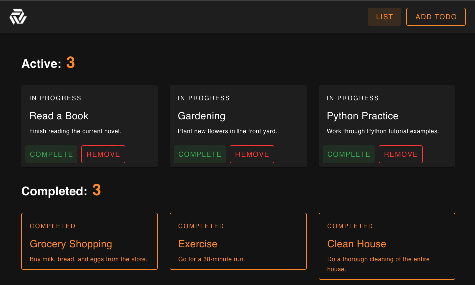

# Todo List

This project is Todo list developed with Vue.js.
It uses Pinia for state management, Vue Router for routes, and Vuetifyjs for UI components.

Demo link: https://todo-vue-chi-ten.vercel.app



## Project Setup

```sh
npm install
```

### Compile and Hot-Reload for Development

```sh
npm run dev
```

### Compile and Minify for Production

```sh
npm run build
```

# expense-tracker-vue
